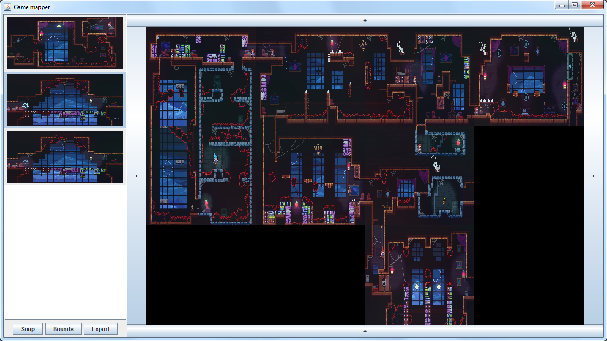

# 2D Game Mapper

Program for taking screenshots of a video, livestream, or game window and stitching them together to form a more cohesive picture of the game world as a whole.
It is mainly meant for 2d games that do not feature any kind of screen scrolling, although it may be suitable for others.

## Requirements

Requires JDK 8 or newer to build / Java 8 or newer to run

## How to Use

1. If running for the first time or for a new game, screen information should be set using `gm_settings.ini`, the `Bounds` button, or both.
	- `gm_settings.ini` defines the bounding settings of screenshots and exists in the program's current working directory (generally where the jar file is)
		If the file does not exist, some default settings are used.
	- The `Bounds` button creates an overlay on all monitors, allowing the user to click and drag to select the area that screenshots should be taken from.
		This area can alternatively be set with the `screenshot-x`, `screenshot-y`, `screenshot-width`, and `screenshot-height` settings in the config file.
		Using this feature updates the `gm_settings.ini`, or creates the file if it does not already exist.
	- `downscaled-width` and `downscaled-height` in the config file specify the size of an individual screen in the final picture.
		This should generally be much smaller than the screenshot size so that the resulting picture isn't too huge.
2. Take screenshots using the `Snap` button.
	- Bad, redundant, or otherwise useless screenshots can be deleted by clicking on them in the list on the left and pressing the `Delete` key on the keyboard.
3. Drag screenshots from the list on the left onto the area to the right to place them in the larger picture.
	- The `+` buttons around the area are used to increase the picture size by one screen in that direction.
4. Use the `Export` button to export the final picture.
	- Exporting of pngs, jpegs, and bmps is supported.